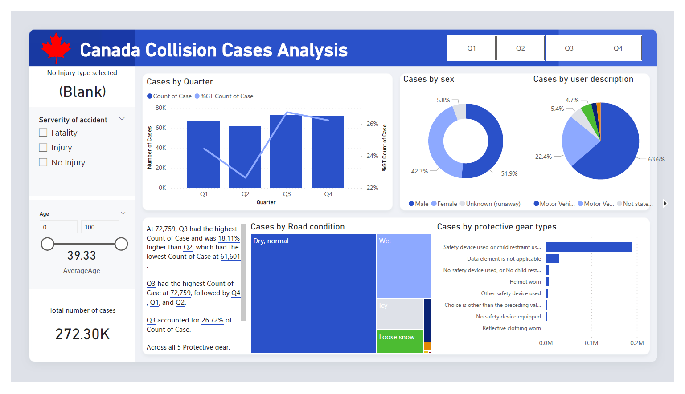

# Canada Road Accident Analysis
This interactive Power BI dashboard was built to analyze over 270,000 road accident records sourced from the Government of Ontario. The goal was to move beyond just "counting crashes" and actually find the patterns, how weather affects severity and which age groups are most at risk.

## Project Preview

## Overview
* **ETL & Data Cleaning:** Handled the heavy lifting in Power Query like filtering out nulls, standardizing data types, and merging tables.
* **DAX:** Wrote custom DAX measures to calculate KPIs like Fatality Rates and Year-over-Year accident trends.
* **Data Visualization:** Designed the layout to be intuitive, using "Slicers" so users can filter by Quarter, Gender, or Safety gear usage and see the data update instantly.

## Technical Setup
Even though I've simplified the view for the dashboard, the backend of this project is a Star Schema relational model involving 20+ tables.
1. **Primary Fact Tables:** I used two main datasets, one for the collision events (environment/location) and one for the victims (demographics/injuries).
2. **Relational Mapping:** I linked these facts to 20+ different dimension tables. This allowed me to map the government's raw numeric codes into human-readable categories without bloating the file size.

## Try it out
1. Download the `Canadian Road Accident.pbix` file and open it in Power BI Desktop.
2. Use the filters on the left to drill down into specific demographics or road conditions.
